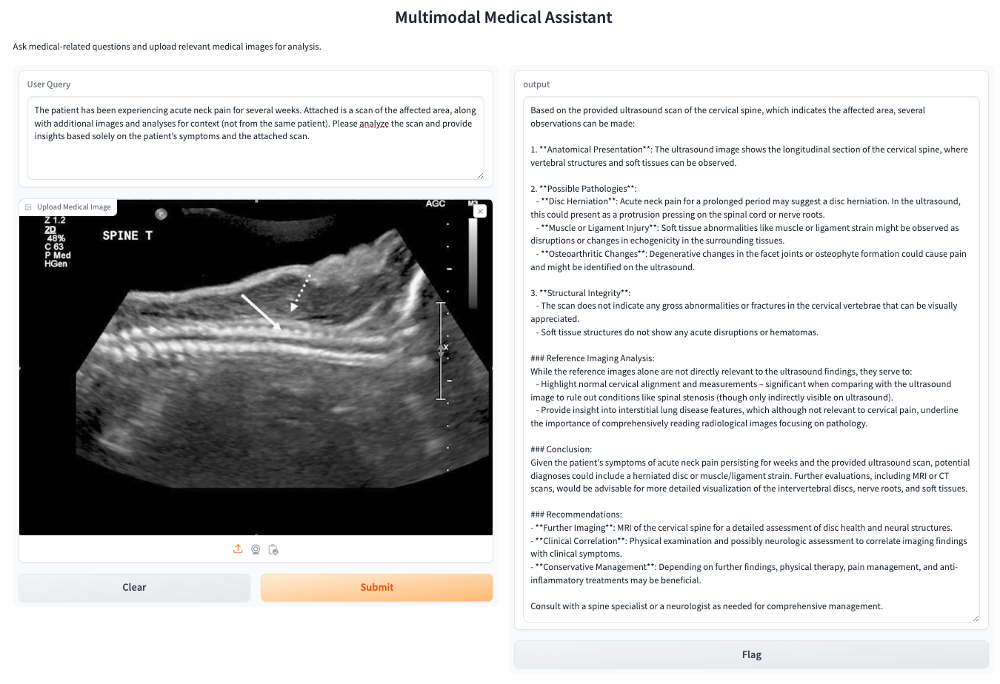
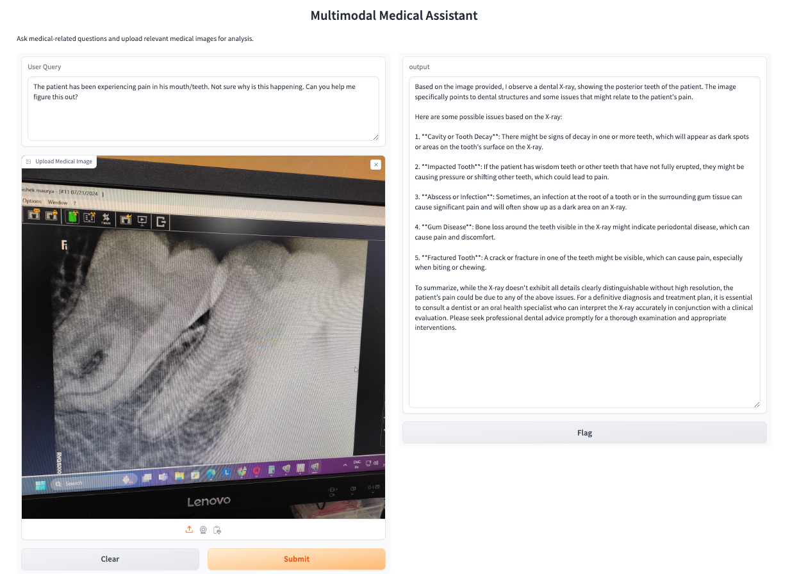

## Objective
The purpose of this chatbot is to help doctors in examining the chest x-ray images and help them in diagnosis.

[//]: # (## Sign up on Qdrant)

[//]: # (- Go to https://qdrant.tech/ and click on "Start Free" button on top right.)

[//]: # (- You may sign up with your Google account or Github account.)

[//]: # (- I'm going ahead with my google account.)

[//]: # (- Create your first cluster. ![img.png]&#40;docs_files/img.png&#41;)

[//]: # (- Give it your name and click on 'Create Free Cluster'.)

[//]: # (- Save your api cluster in your .env file.)

[//]: # (- It'll take some time to get your cluster ready. So, have some patience, good things take time! )

[//]: # (- After completing all the steps, your dashboard would look something like this - ![img_1.png]&#40;docs_files/img_1.png&#41;)

## Dataset - 
The MIMIC Chest X-ray (MIMIC-CXR) - https://physionet.org/content/mimic-cxr/2.1.0/

## Output

